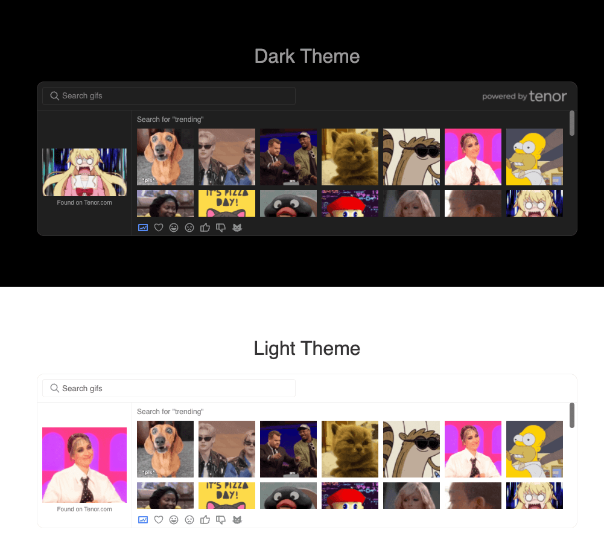

# Tenorer

A simple gifs searching panel for Tenor Api



# Examples

```typescript
import { Tenorer } from "tenorer";

let T = new Tenorer({
  //  https://tenor.com/developer/keyregistration
  APIKey: "YOU_API_KEY",
  el: document.getElementById("box"),
});

T.$on("select", (imgObj) => {
  console.log(imgObj, "gif selected");
});
```

# Options

## APIKey

type: string;

default: '';

### descriptions:

tenor Api key, u can find it form [here](https://tenor.com/developer/keyregistration)

## el

type: HTMLElement

default: undefined

### descriptions:

Pass A DomElement that needs to gen the searching panel

## theme

type: "light" | "dark";

default: "dark"

## limit

limit: number;

default: 7 \* 7

### descriptions:

The limit parameter passed when fetching the api

# License

This project is licensed under the MIT License.
